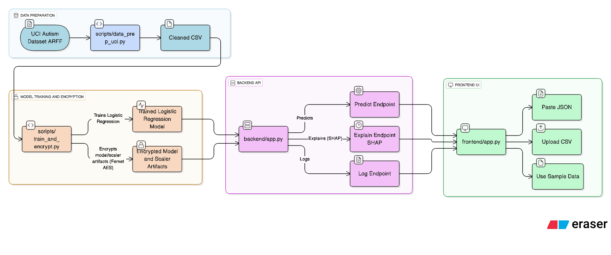

---

```markdown
# 🧠 ASD Early-Screen — Secure, Explainable ML for Early Autism Risk Detection

> ⚡️ **Category:** Tech for Good  
> 🖥️ **Platform:** IBM LinuxONE (Jupyter + Flask)  
> 🔒 **Focus:** Secure, Scalable, Explainable ML  
> 👥 **Built for:** IBM Z Datathon 2025 (Shooting Stars Foundation)

---

## 🩺 What this project does

This project builds a **risk-screening tool** that predicts the likelihood of **Autism Spectrum Disorder (ASD)** in children, based on behavioral and developmental responses.  
It’s *not* a diagnostic tool — instead, it helps flag **early warning signs** for follow-up screening or clinical review.

Built to run **securely on IBM Z’s LinuxONE cloud platform**, the project emphasizes:

- 🔒 **Data security & model encryption**
- 📊 **Explainability (SHAP visual insights)**
- ⚙️ **Scalability & portability**
- 🤖 **Transparent machine learning (Logistic Regression)**

---

## ⚙️ System Overview

```




```

### 🧩 Tech Stack

| Layer | Tools / Libraries | Description |
| ------ | ---------------- | ------------ |
| 🧠 Model | `scikit-learn` (LogisticRegression) | Predicts ASD risk |
| 🔒 Security | `cryptography.Fernet` | AES-based artifact encryption |
| 🧾 Explainability | `SHAP`, `matplotlib` | Per-feature contributions & plots |
| 🧰 Backend | `Flask`, `Gunicorn` | REST API for predictions |
| 💡 Frontend | `Flask` + `HTML/CSS/JS` | Simple web app for input/output |
| ☁️ Deployment | IBM LinuxONE, `pyngrok` | Exposed via secure public tunnel |
| 🧑‍⚖️ Audit/Fairness | JSON + logs | Traceable, PII-safe logging |

---

## 🔍 Features

✅ **Secure Artifacts**

- Model + Scaler files are encrypted using Fernet (AES-128).
- Only decrypted in memory during runtime.

✅ **Explainable Predictions**

- SHAP generates per-sample feature explanations (bar/waterfall plots).
- Feature importance summary shown in UI.

✅ **Simple Frontend**

- Paste JSON / Upload CSV / Load sample row.
- Displays probability, risk color band, and SHAP visualization.

✅ **Safe Logging**

- Logs hashed input fingerprints (SHA-256), latency, prediction — no PII.

✅ **Scalable & Modular**

- Easily extensible for new features, re-training, or integration with Watsonx.ai.

---

## 🧱 Project Structure

```

autism/
├── data/
│   ├── raw/                     ← Put UCI .arff here
│   ├── processed/               ← Cleaned CSV
│   └── sample/                  ← sample_row.csv for testing
│
├── scripts/
│   ├── data_prep_uci.py         ← Parse ARFF → Clean CSV
│   └── train_and_encrypt.py     ← Train model, encrypt artifacts
│
├── backend/
│   ├── app.py                   ← Flask backend (predict/explain)
│   ├── requirements.txt
│   ├── core/
│   │   ├── inference.py         ← Decrypt + predict + SHAP
│   │   ├── model_store.py       ← Fernet decryption utilities
│   │   ├── key_manager.py       ← Key load/rotation logic
│   │   ├── fairness.py          ← Fairness metrics loader
│   │   └── audit.py             ← Hash-based logging
│   └── artifacts/               ← model_v1.pkl.enc, scaler_v1.pkl.enc, fernet.key
│
├── frontend/
│   ├── app.py                   ← Flask UI (proxy to backend)
│   ├── templates/index.html     ← Main web interface
│   └── static/style.css         ← Clean UI styling
│
└── README.md

````

---

## 🧰 Setup Guide (for LinuxONE or local)

> **All commands should be run inside the `autism/` folder**

### 1️⃣ Prerequisites

- Python 3.10+
- `pip`, `venv`
- (optional) Verified [ngrok](https://ngrok.com) account for tunneling

### 2️⃣ Install dependencies

```bash
pip install -r backend/requirements.txt
pip install -r frontend/requirements.txt
````

### 3️⃣ Preprocess the dataset

Place `Autism-Child-Data.arff` inside `data/raw/`, then:

```bash
python3 scripts/data_prep_uci.py
```

✅ Output:

* `data/processed/autism_clean.csv`
* `data/sample/sample_row.csv`

### 4️⃣ Train & Encrypt

```bash
python3 scripts/train_and_encrypt.py
```

✅ Artifacts generated:

```
backend/artifacts/
├── model_v1.pkl.enc
├── scaler_v1.pkl.enc
└── fernet.key
```

### 5️⃣ Run Backend

```bash
export FERNET_KEY_PATH=backend/artifacts/fernet.key
export MODEL_ENC=backend/artifacts/model_v1.pkl.enc
export SCALER_ENC=backend/artifacts/scaler_v1.pkl.enc
export FAIRNESS_JSON=backend/artifacts/fairness_v1.json
export ADMIN_TOKEN=hardtoken123

# Dev mode
python3 backend/app.py
# or production mode
gunicorn --workers 1 --bind 0.0.0.0:5000 backend.app:app
```

### 6️⃣ Run Frontend

```bash
cd frontend
python3 app.py
# or flask run --host=0.0.0.0 --port=8890
```

Frontend is now served at:
👉 `http://127.0.0.1:8890` (local)
👉 or via Jupyter proxy:
`http://<your-linuxone-url>/user-<user>/proxy/8890/`

---

## 🌐 Remote Access (Optional via Ngrok)

Expose your frontend securely:

```bash
pip install pyngrok
python3 - <<'PY'
from pyngrok import ngrok
t = ngrok.connect(8890, "http")
print("🌍 Public URL:", t.public_url)
import time; time.sleep(9999)
PY
```

You’ll get a link like:

```
https://unique-name.ngrok-free.dev → http://localhost:8890
```

---

## 🧪 Testing the API

### Example: Python test

```python
import requests, json, pandas as pd

BASE = "http://127.0.0.1:5000"
print(requests.get(f"{BASE}/health").text)

sample = pd.read_csv("data/sample/sample_row.csv").iloc[0].to_dict()
sample.pop("label", None)

res = requests.post(f"{BASE}/predict", json=sample)
print(json.dumps(res.json(), indent=2))
```

### Example Input (Low-Risk)

```json
{
  "A1_Score": 0,
  "A2_Score": 0,
  "A3_Score": 0,
  "A4_Score": 0,
  "A5_Score": 0,
  "A6_Score": 0,
  "A7_Score": 0,
  "A8_Score": 0,
  "A9_Score": 0,
  "A10_Score": 0,
  "age": 7.0,
  "gender_m": 1,
  "jundice_yes": 0,
  "austim_yes": 0
}
```

Expected output:

```json
{
  "model_version": "v1",
  "probability": 0.05,
  "prediction": 0,
  "explanation": "Top contributing features: A3_Score, A6_Score, A9_Score",
  "latency_ms": 390
}
```

---

## 🧩 Explainability (SHAP)

SHAP (**SHapley Additive exPlanations**) breaks down each prediction into per-feature contributions.

* Backend uses `LinearExplainer` (optimized for LogisticRegression).
* SHAP plots are rendered with Matplotlib, converted to base64 PNG, and sent to frontend.
* Frontend fetches SHAP images only when the user clicks “Show SHAP”.

Example explanation flow:

```
Frontend JSON → Backend /predict
  → model.predict_proba() → SHAP explainer(X)
  → SHAP values → PNG plot → base64 → frontend → 
```

---

## 🔐 Security & Fairness

**Model Encryption**

* Uses `cryptography.Fernet` (AES-128 symmetric).
* Key file (`fernet.key`) stored in artifacts dir.
* Only decrypted temporarily during load.

**Audit Logging**

* Logs `input_hash`, `latency`, `probability`, `prediction` (no raw inputs).

**Fairness JSON (optional)**

You can generate fairness metrics manually and save as:

```
backend/artifacts/fairness_v1.json
```

The `/fairness` endpoint then serves this to the frontend sidebar.

---

## 🧮 Internals Overview

| Module                          | Purpose                                                                   |
| ------------------------------- | ------------------------------------------------------------------------- |
| `data_prep_uci.py`              | Parses `.arff`, cleans, encodes categorical variables, creates `label`    |
| `train_and_encrypt.py`          | Trains model + scaler → encrypts artifacts using Fernet                   |
| `inference.py`                  | Loads + decrypts model, predicts, generates SHAP image & text explanation |
| `model_store.py`                | Handles Fernet decryption and artifact loading                            |
| `key_manager.py`                | Creates & loads encryption key                                            |
| `audit.py`                      | Secure input hashing + inference logging                                  |
| `fairness.py`                   | Loads fairness metrics JSON                                               |
| `frontend/app.py`               | Lightweight UI + proxy for backend `/predict`                             |
| `frontend/templates/index.html` | SPA-style UI with JSON/CSV upload & SHAP toggle                           |
| `frontend/static/style.css`     | Modern responsive layout (green/yellow/red risk band)                     |

---

## ⚖️ Ethical Use Disclaimer

> ⚠️ **This project is a research and educational prototype.**
> It is **not validated for clinical or diagnostic use**.
> Results should **not** be used to make real-world decisions about individuals.
> Always consult qualified professionals for any autism evaluation.

---

## 🧠 Future Work

* 🩵 Integrate with **IBM watsonx.ai** for explainability comparison.
* 🛡️ Add **role-based access** for audit and admin endpoints.
* 📊 Implement fairness dashboards (gender/age parity metrics).
* ☁️ Deploy via **IBM Cloud or Docker** for portability.
* 🧩 Add real-time SHAP caching and batch explainability.

---

## 🏁 Demo (Quick Highlights)

| Feature          | Screenshot / Description                                |
| ---------------- | ------------------------------------------------------- |
| 🔹 Input         | JSON / CSV / Sample Row                                 |
| 🔹 Prediction    | Probability bar + Low/High risk text                    |
| 🔹 SHAP          | Click “Show SHAP” → displays feature impact             |
| 🔹 Audit         | Hash-logged predictions in `backend/logs/inference.log` |
| 🔹 Security      | All artifacts encrypted (`*.enc`)                       |
| 🔹 Accessibility | Runs inside Jupyter / LinuxONE with proxy or ngrok      |

---

## 🧾 License

MIT License © 2025

Use, modify, and share — just don’t use it for real medical decisions.

---

## 👩‍💻 Authors / Maintainers

* **Yadu** — Engineering | ML, Backend, and Architecture
* Built with ❤️ for IBM Z Datathon 2025
* Guided by the principle: “Secure, Explainable, and Ethical AI”

---

> “AI for good means building systems that help people — not replace them.
> This project’s purpose is to *assist*, not *diagnose*.” 🩵

---

## ⭐️ How to Run Everything in 90 Seconds

```bash
# 1️⃣ Prep data
python3 scripts/data_prep_uci.py

# 2️⃣ Train model
python3 scripts/train_and_encrypt.py

# 3️⃣ Start backend
gunicorn --bind 0.0.0.0:5000 backend.app:app

# 4️⃣ Start frontend
python3 frontend/app.py

# 5️⃣ Visit http://127.0.0.1:8890 or ngrok URL
```

> ✅ Paste JSON → Predict → Click “Show SHAP” → Done.

```

---

```
